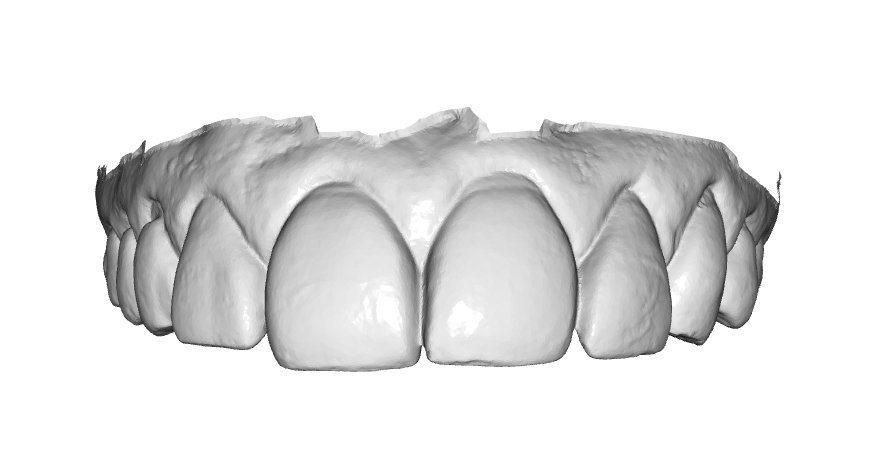
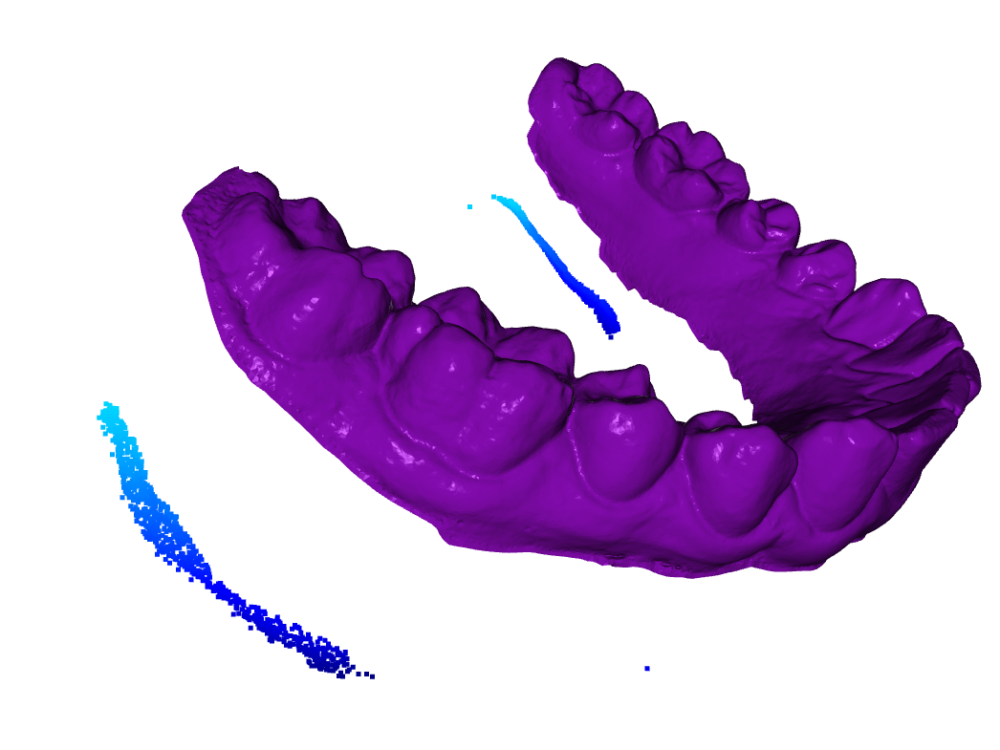
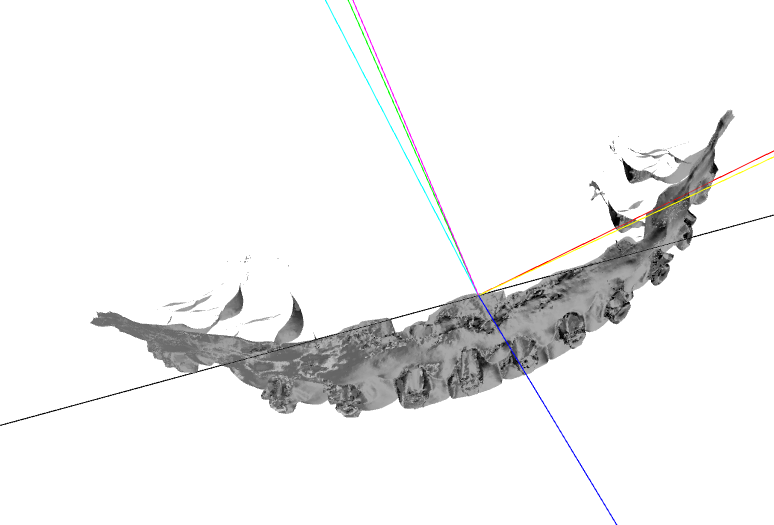

# Mesh Alignment 

## This code takes .stl files of dental mouth scans 

## and returns them all oriented with the incisors centered at (0,0,0), facing the viewer (or optionally vertically, teeth pointing at the viewer)
.

## The method is as follows:

1. I calculate a downsampled point cloud representation to save resources, and I only sample maximally distant points to capture "global" symmetries all meshes share while avoiding the significant mesh variation

2. The point clouds are each centered on their center of mass to unify their coordinate systems, after which the principal components of the point clouds are calculated. The coordinate systems are such that $\hat{z}$ points directly out of the page, $\hat{y}$ points up, and $\hat{x}$ points to the right,

3. The rotations required to orient the point cloud's principal components [PC1,PC2,PC3] to lie along the coordinate axes are found and a total rotation operator can be constructed which is then applied to the mesh itself.

4. Due to the principal components of each mesh having various parities with respect to the coordinate axes, a few raycast checks determine if the oriented mesh has the correct parity:
    
    4.1. A ray is fired along $\hat{z}$. If it does not intersect anything, the mesh is backwards and therefore we rotate by $\pi$ about $\hat{y}$.

    4.2. A ray is fired along $-\hat{y}$, as some meshes include the roof of the mouth. This easily catches any of those whos third principal component, the one which aligns normal the roof of the mouth, is anti-aligned with $\hat{y}$. They get rotated $\pi$ about $\hat{z}$.

5. The meshes which still lie upside-down do not have roofs for a raycast check to intersect, but the meshes are orientable with surface element normals. Since these meshes are idealized as a partial tori specified by $\phi,\theta$ over toroidal angle $\phi\in[0,\pi]$, poloidal angle $\theta\in[\pi,2\pi]$, there are theoretically 0 surface normals with a component along $+\hat{y}$. Therefore if  $\sum^{N}_{i=1}{\hat{n_i}\cdot\hat{y}} \geq 0$,  the mesh gets a $\pi$ rotation about $\hat{z}$. $^\dag$ 

    ${^\dag}$ $\textit{yes I recognized afterwords this this makes}$ 4.2 $\textit{redundant}$

6. The meshes could still use some final adjustments to fix minor tilt about $\hat{x}$ and $\hat{z}$, so we can flatten their downsampled point clouds along a principal axis aligned with them, for example PC1 with $\hat{z}$ and treat the points in the [PC1=0,PC2,PC3] plane as a distribution. The best fit slope should lie as parallel to $\hat{x}$ as possible, so we can find the angle between them and construct the proper rotation matrix to correct.

7. There is a loss functionality that allows the code to be looped with partial final adjustments to zero in on best fit orientations, but it is mostly unecessary and therefore unused.

8. Once all models are fully oriented, they are stored in an output folder labelled "oriented_models" and a random one is displayed. This code worked on all the 10 provided samples for me and I was told it corrected 99/100 of their total sample set.

# Required Libraries
* numpy==2.2.6
* open3d==0.19.0

# How to run this project in your environment

1. clone this project:
    'git clone https://github.com/DOWingard/Dental-Mesh-Alignment'
2. pip install -r requirements.txt
4. Executable in terminal via:  python3 -m orient_models   
